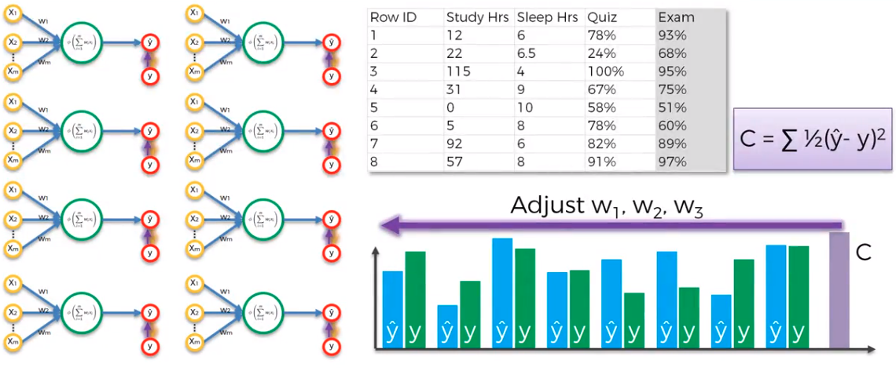
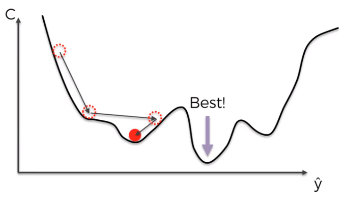

# How do Neural Networks Learn

## Cost function

> C = 1/2 (ŷ - y)²

It calculates the error difference between the actual and the output values
It is desired for the cost function to be as minimized as possible, meaning that the model is as accurate as possible

After calculating the cost (error), it is feeded back into the neural network (updates the weights)

> **Epoch** is one complete presentation of the data set to a neural network

## Gradient Descent

Or also known as batch gradient descent method, uses the whole data set (or a batch of it), then adjusts the weights via backpropagation

## Stochastic Gradient Descent

Runs the model then updates the weights right after

It is more likely to find the **global minimum** rather than just the local minimum, compared to gradient descent

It's faster since it doesn't have to hold the whole data set in memory

## Backpropagation

It is the action of moving backwards in the model, to calculate the gradients of loss (*Error*) with respect to the weights
The gradients tend to get *smaller* as we keep moving backwards in the network
This means that the neurons in **earlier layers** learn very **slowly** compared to the later layers in the hierarchy

Earlier layers are important because they are responsible to learn and detect the simple patterns, which are responsible for activating the subsequent (and more powerful) layers

Which means that if an earlier layer is wrong, it will keep being wrong until reaching the end, but will take too long to learn and adjust

1. Randomly initialise the weight ot small numbers close to `0` (but not `0`)
2. Input the first observation of yor dataset in the input layer
3. **Forward-Propagation**: the neurons are activated in a way the impact of each neuron's activation is limited by the weights
4. Compare the predicted result to the actual result. Measure the generated error
5. **Back-propagation**: the error is propagated backwards, updating the weights according to how much they are responsible for the error
6. Repeat `1-5` and update the weights after each observation (**Reinforcement Learning**)
    Repeat `1-5` but update the weights only after a batch of observations (**Batch Learning**)

> **Epoch**: when the whole training set passed through the **ANN**

## References

[StackExchange - A list of cost functions](http://stats.stackexchange.com/questions/154879/a-list-of-cost-functions-used-in-neural-networks-alongside-applications)
[Basic Python Network](http://iamtrask.github.io/2015/07/12/basic-python-network/)